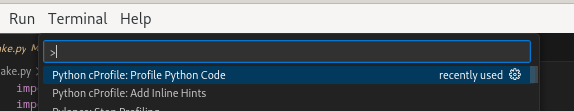
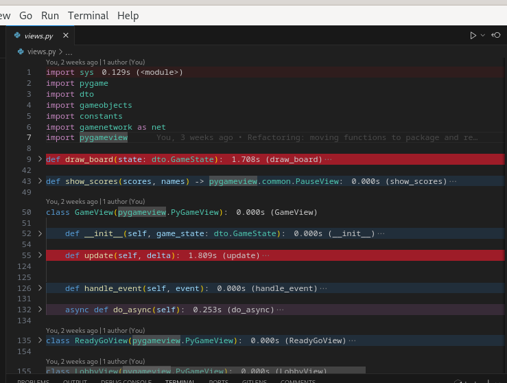

# python-cprofile vscode extension

Wrapper for builtin python module 'cProfile' for profiling python code (measure time of execution for all functions/methods).  

## Features

This extension has 2 helpful commands.

### python-cprofile.profileCode
Runs shell command for executing cProfile python module for current file and generates profile output that can be parsed later
### python-cprofile.addInlineHints
Runs autamically after opening new file to add inline hints (trigger it manually for error messages if something go wrong on your side)

## Requirements

- `ms-python.python` vscode extension for detecting python language and selected virtual environment for workspace

## Extension Settings

* `python-cprofile.cprofileOutputFileName`: Name of the output file for cProfile python module (or path relative to workspace root). This extension is not creating any folders so if you decide to use path, you need to make sure all folders are already created.

## Known Issues

- None

## Release Notes

### 1.0.0

Initial release.